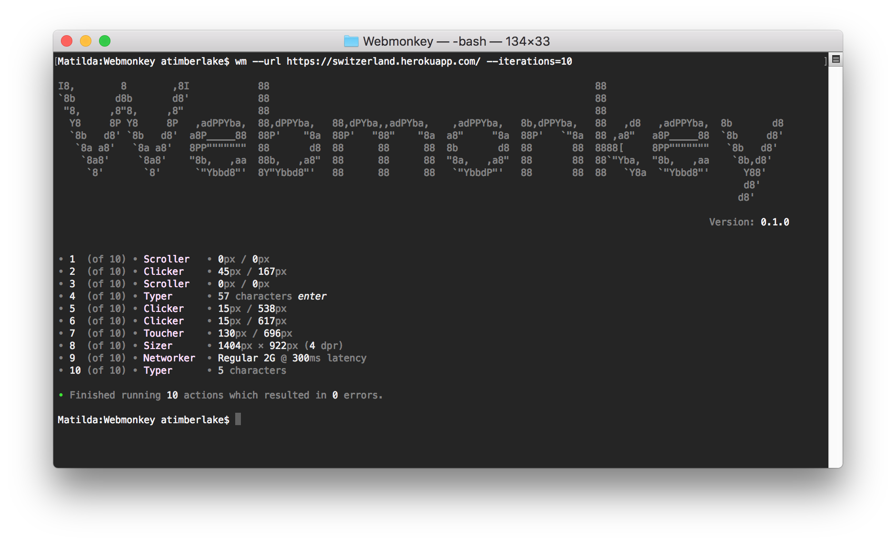

# Webmonkey

> Robust and versatile headless monkey testing for the modern web with reproducible steps, error alerts, strategy sharing and many other good things.


&nbsp;

&nbsp;

&nbsp;

&nbsp;
[](https://github.com/prettier/prettier)

It's important to remember that [monkey testing](https://en.wikipedia.org/wiki/Monkey_testing) should be used in conjunction with smarter tests such as [integration tests](https://en.wikipedia.org/wiki/Integration_testing).



## Getting Started

```console
foo@bar:~$ node --experimental-modules ./bin/index.mjs --debug --url https://news.bbc.co.uk/
```
